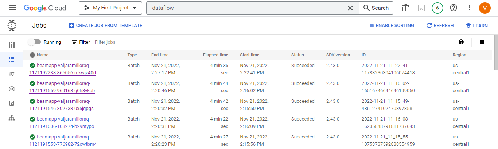
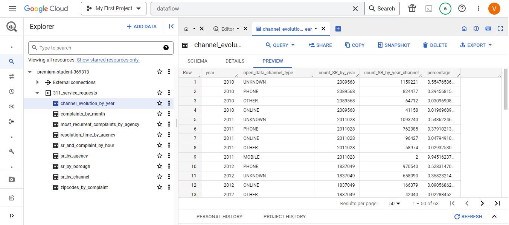

# Google Cloud Project - Dataflow Pipeline
This Google Cloud Project contains a Dataflow Pipeline to read files in CSV from Google Cloud Storage to BigQuery and display dashboards with results in Tableau. The CSV files are the reports obtained from the [analysis of the "311 Service Requests" dataset](https://github.com/valentinajaramillor/bigdataprogram-applaudo).

## Folder and File Description
|      Element      | Description                                                                                                                                                                                                                                                            |
|:---------------------:|--------------------------------------------------------------------------------------------------------------------------------------------------------------------------------------------------------------------------------------------------------------------|
|         data/         | It includes all the sub-folders corresponding to the reports that will be loaded into BigQuery. Each folder contains a ``data.csv`` file with the data and its ``schema.json`` with the schema structure.                                                          |
| data/report_names.txt | This text file lists the names of the subfolders that will be read by the script to generate an extract-transform-load job for each one, from the files ``data.csv`` and ``schema.json `` corresponding.                                                           |
|       src/       | Contains the python script [pipeline.py](.src/pipeline.py) that will generate the jobs in Dataflow to read the data from Cloud Storage and load it into BigQuery. |

To configure the environment and the requirements to run the pipeline, the following sections provide the details of each step.

## 1. Getting Started

### 1.1. Set the default project to your selected project for the deployment of the pipeline:

```shell
gcloud config set project <YOUR_PROJECT_ID>
```

### 1.2. Create a service account and provide it with the required permissions to use the Dataflow, Cloud Storage, BigQuery, etc:
```shell
gcloud iam service-accounts create <YOUR_SERVICE_ACCOUNT_NAME>

gcloud projects add-iam-policy-binding premium-student-369313 --member="serviceAccount:dataflowpipeline@premium-student-369313.iam.gserviceaccount.com" --role=roles/bigquery.dataEditor

gcloud projects add-iam-policy-binding premium-student-369313 --member="serviceAccount:dataflowpipeline@premium-student-369313.iam.gserviceaccount.com" --role=roles/storage.admin

gcloud projects add-iam-policy-binding premium-student-369313 --member="serviceAccount:dataflowpipeline@premium-student-369313.iam.gserviceaccount.com" --role=roles/dataflow.admin

gcloud projects add-iam-policy-binding premium-student-369313 --member="serviceAccount:dataflowpipeline@premium-student-369313.iam.gserviceaccount.com" --role=roles/dataflow.worker
```

Also, the role "Service Usage Admin" has to be provided also, it can be done through the Google Cloud Console, in IAM & Admin > IAM and editing the principal for the service account that is going to be used.

### 1.3. Create the keys.json to manage the credentials:
```shell
gcloud iam service-accounts keys create <YOUR_HOME_PATH>/keys.json --iam-account=<YOUR_SERVICE_ACCOUNT_NAME>@<YOUR_PROJECT_ID>.iam.gserviceaccount.com
```

### 1.4. Clone this repository to store it locally in the home path of the Google Cloud Terminal:
```shell
git clone https://github.com/valentinajaramillor/GCP_Tableau.git
cd GCP_Tableau/
```
### 1.5. Enable the Google Cloud Storage and Dataflow APIs:
```shell
gcloud services enable storage-component.googleapis.com dataflow.googleapis.com
```

## 2. Creating a New Cloud Storage Bucket
Then, it is required to create a new Cloud Storage Bucket to store the data folder with the report files in CSV format and their schemas, and also, to store the temporary files of the Dataflow jobs:

```shell
gsutil mb gs://<YOUR_BUCKET_NAME>
```

## 3. Copying Files to the Cloud Storage Bucket
Then you have to copy the data folder to the newly created bucket:

```shell
gsutil cp -r data/ gs://<YOUR_BUCKET_NAME>
```

## 4. Creating a BigQuery Dataset
To store the final tables with the reports, a BigQuery dataset has to be created:
```shell
bq mk <YOUR_DATASET_NAME>
```

## 5. Building the Dataflow Pipeline
The Dataflow pipeline was built following the examples of the [GCP examples](https://github.com/GoogleCloudPlatform/professional-services/tree/main/examples/dataflow-python-examples/batch-examples/cookbook-examples), to ingest data from files (and their schemas) stored in Google Cloud Storage into Bigquery. The code was modified to support reading more than one file from GCS at once, and applying its respective schema, also stored in GCS, and finally creating one Dataflow job per report table.

The pipeline code splits the CSV files and transforms them to a format that can be read by BigQuery:

```python
class DataIngestion:
    """A helper class which contains the logic to translate the file into
    a format BigQuery will accept."""

    @staticmethod
    def parse_method(string_input, schema_json):
        """This method translates a single line of comma separated values to a
        dictionary which can be loaded into BigQuery.
        Args:
            string_input: A comma separated list of values
            schema_json: The schema of the data in json format
        Returns:
            A dict mapping BigQuery column names as keys to the corresponding value
            parsed from string_input.
         """

        # Strip out carriage return, newline and quote characters.
        values = re.split(",", re.sub('\r\n', '', re.sub('"', '',
                                                         string_input)))

        # Get the fields name from the corresponding schema json file
        field_names = tuple(field['name'] for field in schema_json['fields'])

        # Create a row as a dictionary of field names and values
        row = dict(zip(field_names, values))
        return row
```

The following code represents the Dataflow pipeline, with its three steps "Read from a File", "String To BigQuery Row" and "Write to BigQuery": 

```python
(p
         # Read the file. This is the source of the pipeline. All further
         # processing starts with lines read from the file. We use the input
         # argument from the command line. We also skip the first line which is a
         # header row.
         | 'Read from a File ' + input_file >> beam.io.ReadFromText(data_path, skip_header_lines=1)

         # This stage of the pipeline translates from a CSV file single row
         # input as a string, to a dictionary object consumable by BigQuery.
         # It refers to a function we have written. This function will
         # be run in parallel on different workers using input from the
         # previous stage of the pipeline.
         | 'String To BigQuery Row ' + input_file >>
         beam.Map(lambda s: data_ingestion.parse_method(string_input=s,schema_json=schema_json)) |

         # This stage of the pipeline translates from a CSV file single row
         # input as a string, to a dictionary object consumable by BigQuery.
         # It refers to a function we have written. This function will
         # be run in parallel on different workers using input from the
         # previous stage of the pipeline.
         # 'Inject Timestamp - ' + input_file >> beam.ParDo(InjectTimestamp()) |
         'Write to BigQuery - ' + input_file >> beam.io.WriteToBigQuery(
                    # The table name passed in from the command line
                    known_args.bq_dataset + '.' + table_name,
                    # Schema of the table
                    schema=schema_json,
                    # Creates the table in BigQuery if it does not exist
                    create_disposition=beam.io.BigQueryDisposition.CREATE_IF_NEEDED,
                    # Data will be appended to the table
                    write_disposition=beam.io.BigQueryDisposition.WRITE_TRUNCATE
                )
         )
```

## 6. Execution of the Dataflow Jobs
To run the Dataflow pipeline, and create a job for each report, the following steps were considered:

### 6.1 Set up the Python environment
In the terminal, create a python virtual environment:
```shell
sudo apt-get install -y python3-venv
python3 -m venv df-env
source df-env/bin/activate
```
Then, install the packages you will need to execute your pipeline:
```shell
python3 -m pip install -q --upgrade pip setuptools wheel
python3 -m pip install apache-beam[gcp]
pip install --upgrade google-cloud-storage
```

Finally, set the environment variables, and replace with the values that you used in previous steps:
```shell
export GOOGLE_APPLICATION_CREDENTIALS=<YOUR_KEYS_JSON_PATH>
export PROJECT=<YOUR_PROJECT_ID>
export INPUT_BUCKET=<YOUR_BUCKET_NAME>
export INPUT_PATH=data
export FOLDERS_LIST=report_names.txt
export BQ_DATASET=<YOUR_DATASET_NAME>
```

### 6.2. Running the Dataflow Pipeline
Run the Dataflow pipeline:
```shell
python3 pipeline.py \
--project=$PROJECT --region= \
--runner=DataflowRunner \
--staging_location=gs://$INPUT_BUCKET/test \
--temp_location gs://$INPUT_BUCKET/test \
--input-bucket=$INPUT_BUCKET \
--input-path=$INPUT_PATH \
--input-folders-list=$FOLDERS_LIST \
--bq-dataset=$BQ_DATASET
```

## 7. Results and Dashboards

### 7.1. Dataflow jobs
Here you can see some of the jobs listed in the Dataflow Console:



### 7.2. BigQuery Tables
After the jobs are completed (Status: "Succeeded"), you can see the tables in BigQuery, like this:



### 7.3. Dashboards in Tableau
The first dashboard shows the visualization of the amount of service requests by agency, complaint type and channel type:


